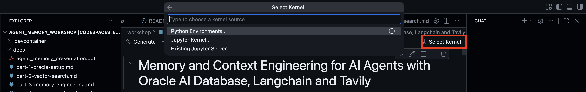

# Financial Fraud Agent Harness Workshop — Lightweight

**Build a memory-aware AML / financial-crime data agent on Oracle AI Database 26ai in 90 minutes — then see the same harness running as a Flask + React app.**

[](https://codespaces.new/jasperan-org/financial-fraud-agent-harness-workshop-lightweight)

---

## What you will build (and run)

> **From notebook concept to a running app.** The Codespace already has the *same* harness running as a Flask + React application on the *same* Oracle — open it at [http://localhost:3000](http://localhost:3000) and watch the concept you are coding become a live product. The notebook teaches the pattern; the app shows it deployed.

This repository has two deliberately different learning surfaces:

1. **The 90-minute notebook** — [`notebook_student.ipynb`](notebook_student.ipynb) builds the harness from primitives with **five hands-on TODOs**. Long-term memory via OAMP, hybrid vector + Oracle Text retrieval, a vector-indexed `toolbox` / `skillbox`, context engineering, and the bounded `agent_turn` loop. The answer key is [`notebook_complete.ipynb`](notebook_complete.ipynb); the reference notebook [`enterprise_data_agent.ipynb`](enterprise_data_agent.ipynb) goes further, with a **Part 8** on identity-aware data access.

2. **The running app** — [`app/`](app/) is the **Meridian Bank AML app**: a Flask + Socket.IO backend and a React + Vite front end against the *same* Oracle, the *same* OAMP store, and the *same* `toolbox` / `skillbox` the notebook populates. Chat on the left; live memory pane on the right; an identity selector in the header; a 3D globe the agent can drive.

Every "true setup" task — `AGENT` user creation, `vector_memory_size` / `pga_aggregate_limit`, the in-database ONNX embedder and reranker, the `FINANCE` seed, duality views, Oracle Text, identity rules — is run by the Codespace **before** you open the notebook (`app/scripts/bootstrap.py`, `seed.py`, `setup_advanced.py`, `setup_deep_security.py`). Each TODO has a hard-stop assert below it so a broken implementation surfaces immediately.


## The use case: Meridian Bank / fraud detection

The demo is a fictional global retail bank: **25 branches** and **40 merchants** across four regions (AMERICAS, EUROPE, MIDDLE_EAST, ASIA_PACIFIC), ~200 customers, ~250 accounts, ~285 cards, ~1,200 transactions over 90 days, 60 loans, and **15 Suspicious Activity Reports**.

A slice of the transactions is deliberately suspicious, and `transactions.flag_reason` records *which AML rule fired*:

| Flag reason | Pattern |
|---|---|
| `STRUCTURING` | deposits split just under the reporting threshold |
| `GEO_VELOCITY` | card used in impossible-travel sequences |
| `HIGH_RISK_COUNTRY` | wires to high-risk corridors |
| `RAPID_CASH_OUT` | funds in, cash out within hours |
| `LARGE_CASH_DEPOSIT` | size-triggered review |

That flag column is the fraud use case: it turns "query the bank database" into a money-laundering investigation. See [`docs/fraud-detection-onepager.md`](docs/fraud-detection-onepager.md).

## The five-TODO learning path

| Block | Topic | TODO |
|---|---|---|
| 1 | Setup, Oracle connectivity, and an OpenAI-compatible chat helper | — |
| 2 | OAMP long-term memory and a `FINANCE` catalog scanner | **TODO 1** — `_scan_tables` |
| 3 | Semantic, reranked, and hybrid vector + Oracle Text retrieval | **TODO 2** — `retrieve_knowledge`; **TODO 3** — `hybrid_rrf_search_memories` |
| 4 | Vector-indexed toolbox and skillbox | **TODO 4** — `tool_run_sql` |
| 5 | Context engineering and the bounded agent loop | **TODO 5** — `agent_turn` |

Every TODO has a hard-stop assertion immediately below it. Use the [TODO checklist](docs/TODO-checklist.md) and the matching guides in [`docs/`](docs/) as you work:

| Part | Topic | Guide | Coding TODO? |
|---|---|---|---|
| 1 | Setup & connectivity | [Part 1](docs/part-1-setup.md) | — |
| 2 | Long-term memory with OAMP + scanner | [Part 2](docs/part-2-oamp-memory.md) | **TODO 1** — `_scan_tables` |
| 3 | Retrieval (vector + hybrid RRF) | [Part 3](docs/part-3-retrieval.md) | **TODO 2** — `retrieve_knowledge`<br>**TODO 3** — `hybrid_rrf_search_memories` |
| 4 | DBFS scratchpad *(advanced reference)* | [Part 4](docs/part-4-dbfs.md) | — |
| 5 | Oracle MLE compute sandbox *(advanced reference)* | [Part 5](docs/part-5-mle.md) | — |
| 6 | Tools & skills (vector-indexed registries) | [Part 6](docs/part-6-tools-and-skills.md) | **TODO 4** — `tool_run_sql`<br>§6.5 `focus_world` globe tool *(no TODO)* |
| 7 | The agent loop | [Part 7](docs/part-7-agent-loop.md) | **TODO 5** — `agent_turn` |
| 8 | Identity-aware data access *(advanced reference)* | [Part 8](docs/part-8-deep-data-security.md) | — |
| 9 | JSON Relational Duality Views *(advanced reference)* | [Part 9](docs/part-9-duality-views.md) | — |
| 11 | Tool-output offload *(advanced reference)* | [Part 11](docs/part-11-tool-output-offload.md) | — |

## Start in GitHub Codespaces

1. Click the **Open in GitHub Codespaces** badge above.
2. Click **Create Codespace**. The first build takes ~5–8 minutes: Oracle Free (`23-faststart`, full Spatial + Text image) plus the ONNX models (~117 MB).
3. Wait for the post-create step to finish. It installs the notebook and app dependencies, boots Oracle, and runs `bootstrap.py` → `seed.py` → `setup_advanced.py`.

   

4. Add your `OCI_GENAI_API_KEY` as a Codespaces secret (or drop it into `app/.env`). The notebook falls back to key rotation and a prompt; the app reads `app/.env`.
5. Open [`notebook_student.ipynb`](notebook_student.ipynb) with the **Python 3.11** kernel and run cells from the top.

   

6. The app auto-opens on port **3000** (the React UI) with the Flask backend on port **8000**. Verify Oracle is healthy:

   ```bash
   docker ps    # oracle-free should show (healthy)
   ```

Useful recovery commands inside the Codespace:

```bash
bash .devcontainer/start_app.sh
curl http://localhost:8000/api/health
tail -60 .devcontainer/logs/backend.log
tail -40 .devcontainer/logs/frontend.log
```

## Run locally

You need Docker, Python 3.11+, Node 20+, and either OCI GenAI or OpenAI credentials.

```bash
git clone https://github.com/jasperan-org/financial-fraud-agent-harness-workshop-lightweight
cd financial-fraud-agent-harness-workshop-lightweight

# 1. Oracle AI Database (Docker, ~3 min on first run)
docker compose -f .devcontainer/docker-compose.yml up -d oracle

# 2. Notebook + app backend dependencies
pip install -r requirements.txt
pip install -r app/backend/requirements.txt

# 3. Configure secrets
cp app/.env.example app/.env        # OCI is the default — fill OCI_GENAI_API_KEY

# 4. One-time database setup — run all three, in order
cd app
python scripts/bootstrap.py          # AGENT user, vector pool, ONNX embedder, DBFS
python scripts/seed.py               # FINANCE schema + AML seed + duality views + skillbox
python scripts/setup_advanced.py     # Oracle Text index + scan scheduler
python scripts/setup_deep_security.py # identity rules enforced in the database (Part 8)
cd ..

# 5. Front end
cd app/frontend && npm install && cd ../..

# 6. Run the notebook
jupyter lab notebook_student.ipynb
```

When you finish the notebook, start the app in two terminals:

```bash
cd app/backend && python app.py      # backend  → :8000
cd app/frontend && npm run dev       # frontend → :3000
```

## Running the app

Open [http://localhost:3000](http://localhost:3000). Starter prompts that exercise what you just built:

| Prompt | What it exercises |
|---|---|
| *"What's in the FINANCE schema? Briefly list the entities and relationships."* | Scanner-built institutional knowledge (Block 2) |
| *"Which branch regions have the most FLAGGED or BLOCKED transactions?"* | `run_sql` + the agent loop (Block 4 + Block 5) |
| *"Which merchants are within 1500 km of Dubai right now?"* | Oracle Spatial — `SDO_WITHIN_DISTANCE` against `merchants.location` |
| *"Pull every FLAGGED transaction's amount and use exec_js to compute the mean and median in dollars."* | `run_sql` → `exec_js` (Oracle MLE) |
| *"Give me the complete document for account 7 — customer, branch, cards, transactions."* | `get_document("account_dv", "7")` — JSON Relational Duality Views |
| *"Show me all transactions flagged as STRUCTURING in EUROPE."* | `query_documents("account_dv", where=...)` |
| *"How do I diagnose ORA-00904? Consult any guide you have."* | `load_skill(...)` from the skillbox |
| *"Switch to compliance.officer and list the Suspicious Activity Reports."* | Identity rules enforced in the database (Part 8) — 15 rows instead of 0 |

The right-hand pane fills in after every turn — top semantic memories, recent tool outputs, skill manifest, token usage. Switch the header persona (`agent`, `cfo`, `analyst.east`, `analyst.west`, `compliance.officer`) and the same SQL returns different rows: as `agent` the SAR reports query returns nothing, as `compliance.officer` it returns 15 rows, with no application-layer filtering on the path.

For the full app documentation, see [`app/README.md`](app/README.md).

## Workshop files

```
financial-fraud-agent-harness-workshop-lightweight/
├── .devcontainer/                  Codespaces auto-bootstrap (Oracle 23-faststart)
│   ├── devcontainer.json           Forwards 1521/8000/3000
│   ├── docker-compose.yml          Oracle Free (full image — Spatial + Text)
│   ├── setup_build.sh              pip + npm installs
│   ├── setup_runtime.sh            Oracle + bootstrap + seed + setup_advanced
│   └── start_app.sh                Flask backend + Vite front end
├── notebook_student.ipynb          The 90-minute path — five TODO stubs + asserts
├── notebook_complete.ipynb         The five TODOs, solved
├── notebook_complete_with_setup_code.ipynb   Full source including every Oracle DDL
├── enterprise_data_agent.ipynb     Original end-to-end source notebook
├── docs/
│   ├── part-1-setup.md … part-11-tool-output-offload.md
│   ├── TODO-checklist.md
│   ├── fraud-detection-onepager.md
│   └── troubleshooting.md
├── app/                            Flask + React AML app
│   ├── README.md                   Full app architecture
│   ├── backend/                    Flask + Socket.IO + the harness
│   │   └── db/deep_security.py     Identity probe + DBMS_RLS installer + Deep Sec DDL generator
│   ├── frontend/                   React + Vite + Tailwind UI
│   └── scripts/                    bootstrap.py, seed.py, setup_advanced.py, setup_deep_security.py
├── images/                         Architecture diagrams + Codespaces screenshots
├── scripts/
│   ├── build_student_notebook.py   Notebook integrity check
│   └── insert_part8_section.py     Regenerates notebook Part 8 (idempotent)
└── requirements.txt                Notebook dependencies
```

## Stack

- **Oracle AI Database 26ai Free** via `gvenzl/oracle-free:23-faststart` (full image: Spatial + Text).
- **`oracleagentmemory`** — Oracle AI Agent Memory Package (OAMP) owns the long-term memory schema.
- **`oracledb`** — the official Python Oracle driver.
- **In-database ONNX embeddings** (`all-MiniLM-L12-v2`, 384-dim) via `DBMS_VECTOR.LOAD_ONNX_MODEL`. No hosted embedding API.
- **In-database ONNX cross-encoder** (`RERANKER_ONNX`) via `PREDICTION()`.
- **`openai` SDK** pointed at OCI GenAI's OpenAI-compatible endpoint (or OpenAI directly).
- **App**: Flask + Socket.IO + eventlet (backend); React 18 + Vite + Tailwind + react-globe.gl (frontend).
- **Identity at the kernel**: `DBMS_RLS` row/column policies plus an application context on this Free image — and the same persona registry emits `CREATE DATA GRANT` DDL for 26ai Enterprise-class **Deep Data Security**.

## What is "an agent" in this workshop?

```
Agent = Model + Harness
```

The model emits tokens. Everything else — state, memory, tool dispatch, identity, retry logic, budgets — is harness code. Most "agent quality" complaints are harness problems, not model problems.

The harness you build:

- Stores memories in Oracle (long-term: OAMP; procedural: `scan_history`).
- Embeds and retrieves with in-database SQL (`VECTOR_EMBEDDING`, `PREDICTION`, `CONTAINS`).
- Dispatches tools registered with a single decorator that introspects the function and writes a vector-indexed row.
- Runs the loop in ~90 lines of Python.

The app proves it: those same lines drive a real chat UI against the same Oracle, with end-user identity persona gates, a live memory pane, and a globe the agent can drive.

## Where to next?

- **[Oracle AI Agent Memory Package](https://www.oracle.com/database/ai-agent-memory/)** — full OAMP documentation.
- **[Oracle AI Developer Hub](https://github.com/oracle-devrel/oracle-ai-developer-hub)** — more technical assets, samples, and projects.
- **[`oracle/skills`](https://github.com/oracle/skills)** — the skill library that seeds the skillbox.
- **[`notebook_complete_with_setup_code.ipynb`](notebook_complete_with_setup_code.ipynb)** — the full-source notebook including every Oracle DDL statement. Open this when you want to deploy the harness against an Oracle that isn't the workshop Codespace.

---

Built for the Oracle AI Developer Experience team.
