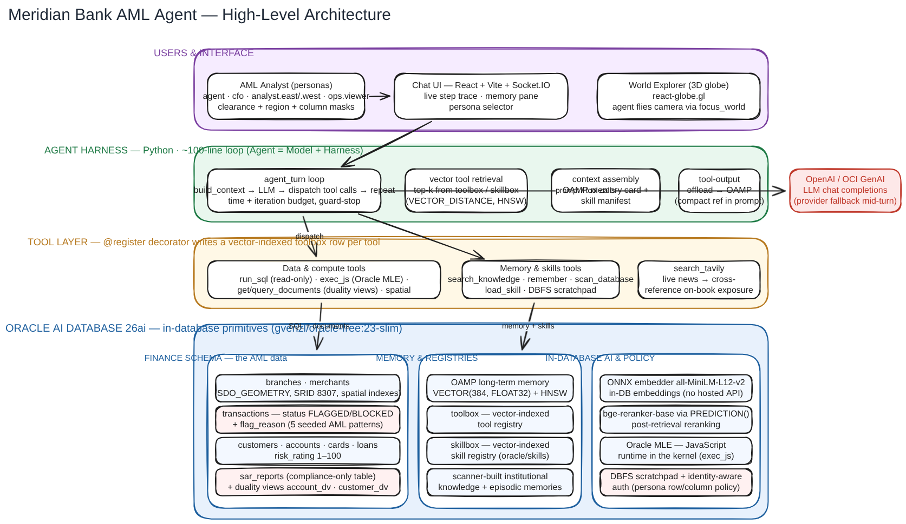
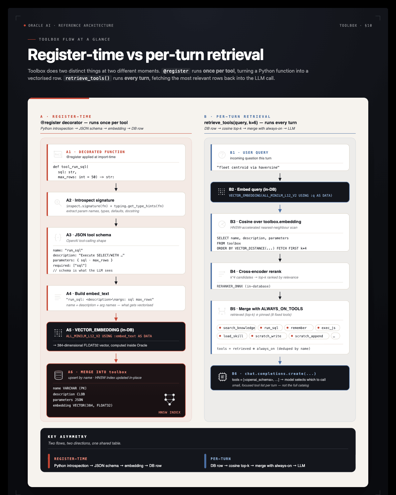
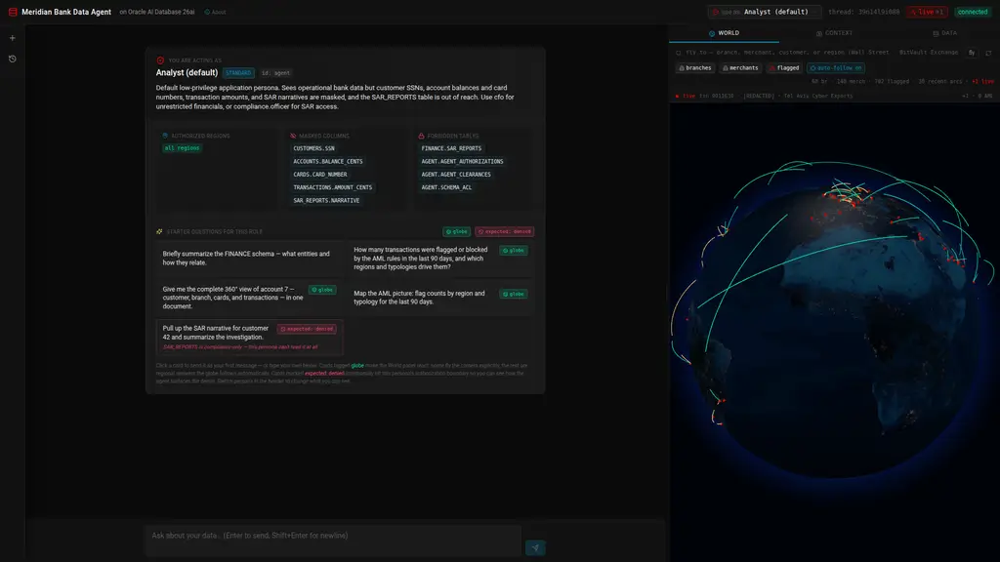
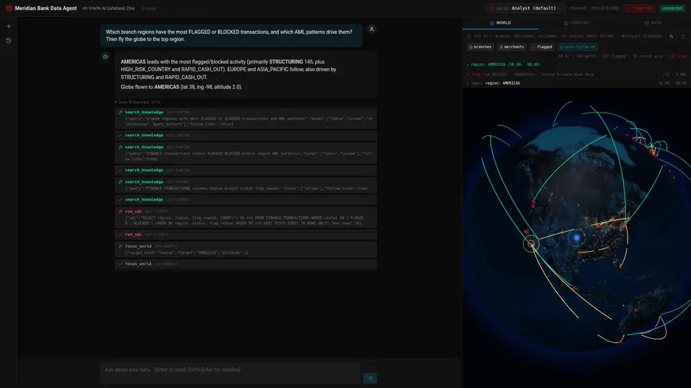
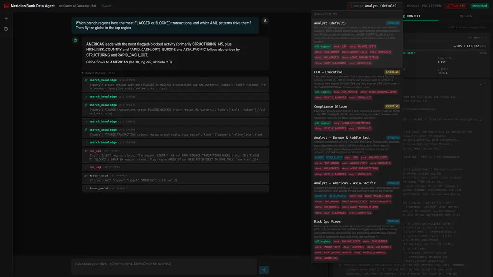
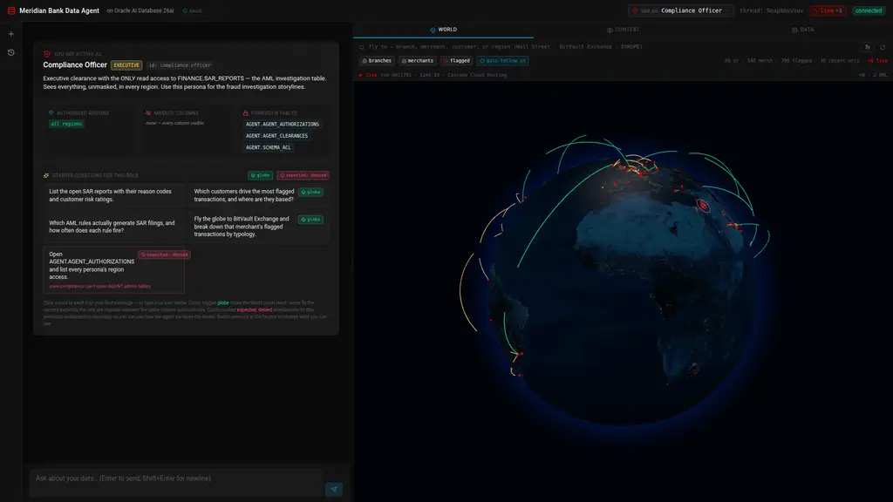

# Financial Fraud Agent Harness Workshop — Lightweight

**Build a memory-aware AML data agent — a Meridian Bank financial-crime analyst — on Oracle AI Database 26ai in 90 minutes. Then watch the same harness run as a Flask + React app.**

[](https://codespaces.new/jasperan-org/financial-fraud-agent-harness-workshop-lightweight)



`Agent = Model + Harness`. The model emits tokens; everything else — memory, retrieval, tool dispatch, identity, budgets — is harness code. This workshop builds that harness twice: from primitives in the notebook, and as a running product in [`app/`](app/).

## The notebook — 90 minutes, nine TODOs

[`notebook_student.ipynb`](notebook_student.ipynb) builds the harness from primitives. Oracle is already provisioned for you (`.devcontainer/provision.sh` runs `app/scripts/bootstrap.py` → `seed.py` → `setup_advanced.py` → `setup_deep_security.py`, idempotently): the `AGENT` user, the in-database ONNX embedder (and, when `RERANKER_URL` is set, the cross-encoder reranker), the seeded Meridian Bank `FINANCE` schema, the Oracle Text index, and the skillbox. Every TODO is harness code, and each one has a hard-stop assert below it — `Run All` is *supposed* to halt.

| Part | Topic | TODO |
|---|---|---|
| 1 | Setup, Oracle connectivity, an OpenAI-compatible chat helper | **TODO 1** — ask the bare model a question |
| 2 | Long-term memory (OAMP) + a catalog scanner | **TODO 2** — `OracleONNXEmbedder.embed` · **TODO 3** — `_scan_tables` |
| 3 | Retrieval — cosine, cross-encoder rerank, hybrid RRF | **TODO 4** — `retrieve_knowledge` · **TODO 5** — `hybrid_rrf_search_memories` |
| 6 | Vector-indexed toolbox and skillbox | **TODO 6** — `retrieve_tools` · **TODO 7** — `tool_run_sql` · **TODO 8** — `tool_list_skills` |
| 7 | Context engineering and the bounded loop | **TODO 9** — `agent_turn` |
| 12 | The bank's morning: an autonomous AML triage (capstone) | *(no TODO — run it)* |

- Answers: [`notebook_complete.ipynb`](notebook_complete.ipynb) — the same notebook, solved, with its outputs saved so you can read it without running anything
- Part-by-part guides: [`docs/`](docs/) · [TODO checklist](docs/TODO-checklist.md) · [troubleshooting](docs/troubleshooting.md)

Parts 4, 5, 8, 9 and 11 (DBFS, MLE, identity / Deep Data Security, duality views, tool-output offload) are guides in [`docs/`](docs/); the notebook covers them in short “rest of the platform” sections and concept checks — read or run them, they add no exercises: **§2.6** OAMP's memory types, relations, one-hop traversal and retention · **§3.6** the same embeddings and three retrieval legs through `langchain-oracledb` (`OracleEmbeddings`, `OracleVS`, `OracleTextSearchRetriever`) · **§6.6** Oracle MLE, Oracle Spatial and duality views as three more tools · **§6.7** identity — one query, five end users, the kernel deciding · **§7.4** tool-output offload with TTL on the offloaded rows.

**The demo bank.** Meridian Bank: 60 branches and 140 merchants (Oracle Spatial) across four regions, 2,000 customers, 2,650 accounts, ~23,600 transactions over 90 days, 900 loans, 117 SAR reports, plus the AML desk's paperwork — sanctions screenings, beneficial owners, wire messages, login events, KYC documents, case notes. A slice of the transactions is deliberately suspicious, and `transactions.flag_reason` records which rule fired: `STRUCTURING`, `GEO_VELOCITY`, `HIGH_RISK_COUNTRY`, `RAPID_CASH_OUT`, `LARGE_CASH_DEPOSIT`. That column is the fraud use case — it turns "query the bank" into a money-laundering investigation ([one-pager](docs/fraud-detection-onepager.md)).



## The app — the same harness, running

The Codespace starts the **Meridian Bank AML app** (Flask + Socket.IO + React) against the same Oracle, the same OAMP store, and the same `toolbox` / `skillbox` the notebook writes to. Open **http://localhost:3000**.


*Every fresh thread opens with the active persona's clearance, authorized regions, masked columns, and forbidden tables — plus starter prompts verified to return real rows for that persona.*


*One turn, the full trace: five `search_knowledge` calls, two `run_sql`, two `focus_world`. On the right, the real World Explorer shows the globe the agent just flew to AMERICAS.*


*Identity is enforced in the database, not the UI: pick a persona and the same SQL returns different rows. As `agent` the SAR query returns nothing; as `compliance.officer` it returns every report, because the kernel decides.*


*World Explorer: branches, merchants, and the suspicious-activity layer — flagged and blocked transactions plotted at their merchant with arcs coloured by AML flag reason, plus a live feed of new transactions.*

What the app adds beyond the notebook: a live memory pane (top memories, tool outputs, skill manifest, token usage) on every turn, the World Explorer globe the agent can fly, per-request identity switching, DBFS scratch tools wired into the loop, the tool-output offload and `fetch_tool_output` recovery path, scheduled rescans, and a triage ledger the notebook's Part 12 writes and the app can read back. (The notebook shows the same platform primitives — MLE, spatial, duality views, identity, offload — in §6.6, §6.7 and §7.4; the app shows them under a UI.)

| Try this in the app | What it exercises |
|---|---|
| *"Which branch regions have the most FLAGGED or BLOCKED transactions?"* | `run_sql` + the agent loop |
| *"Which merchants are within 1500 km of Dubai right now?"* | Oracle Spatial — `SDO_WITHIN_DISTANCE` |
| *"Give me the complete document for account 7 — customer, branch, cards, transactions."* | JSON Relational Duality Views |
| *"List the Suspicious Activity Reports."* | identity in the kernel: all 117 as `compliance.officer`, nothing as the default Analyst |
| *"What did the AML triage desk decide, and what is under review?"* | after notebook Part 12 — `run_sql` over `AGENT.AML_TRIAGE` |

Full documentation: [`app/README.md`](app/README.md).

## The capstone — decisions, not answers

Part 12 stops taking questions and works the queue. The harness builds Meridian Bank's AML alert queue from `FINANCE`, assembles an evidence pack per alert, decides `ESCALATE` / `KYC_REVIEW` / `DISMISS` with a confidence and a written rationale, records every decision in `AGENT.AML_TRIAGE` and in memory, and reports what the run was worth to the bank — with exactly one labelled assumption in the arithmetic. Autonomy is the same loop plus a **trigger, a record, and a budget**. Guide: [`docs/part-12-autonomous-aml-triage.md`](docs/part-12-autonomous-aml-triage.md).

The running app carries that capstone as a live instrument: the **Autonomous** tab works the newest alerts on demand, replaying a **captured Grok-4.3 triage run** (verbatim decisions and per-step latencies, no live tokens spent; alerts without a capture fall through to the harness's `REVIEW_REQUIRED` path), streaming each evidence pack, tool call, decision and ledger row as it happens — while the world feed keeps landing fresh activity on the same customers. See [`app/README.md` §9](app/README.md).

## Run it

**In Codespaces (nothing to install):**

1. Click **Open in GitHub Codespaces** above, then **Create Codespace**. First build ≈ 5–8 minutes: Oracle Free plus the ONNX models (~117 MB).
2. Wait for the post-create step to finish — it installs dependencies, boots Oracle, and provisions the database.
3. Add `OCI_GENAI_API_KEY` as a **Codespaces secret** (restart the Codespace after adding it). The notebook reads it from the kernel environment (and rotates across `OCI_GENAI_API_KEY` + `OCI_GENAI_API_KEY_2..6`), or prompts for it in §1.1; `provision.sh` copies the secret into `app/.env` for the app.
4. Open [`notebook_student.ipynb`](notebook_student.ipynb) with the **Python 3.11** kernel and run from the top. The app is already on port **3000**, the backend on **8000**.

**Provisioning is automatic and idempotent, on every open.** `.devcontainer/provision.sh` probes the database for each layer — `AGENT` schema + ONNX embedder, the `FINANCE` seed + duality views + skillbox, the Oracle Text index, the identity policies — and runs only the `app/scripts/*.py` step that is missing. A warm Codespace is a handful of `SELECT`s; a Codespace whose volume was recreated, whose container was stopped, or whose seed died half-way heals itself with no rebuild and no restart. There is no DDL to run by hand in the 90-minute path.

```bash
bash .devcontainer/provision.sh --probe-only   # what the database already has
bash .devcontainer/start_app.sh                # provision + restart the app
curl http://localhost:8000/api/health          # what the app thinks of its own state
docker ps                                      # oracle-free should show (healthy)
```

**Locally** — Docker, Python 3.11+, Node 18+, and OCI GenAI credentials:

```bash
git clone https://github.com/jasperan-org/financial-fraud-agent-harness-workshop-lightweight
cd financial-fraud-agent-harness-workshop-lightweight
pip install -r requirements.txt -r app/backend/requirements.txt
cp app/.env.example app/.env                     # fill OCI_GENAI_API_KEY (the app reads it; the notebook uses the environment or prompts)
bash .devcontainer/provision.sh                  # Oracle + the four setup scripts (idempotent)
cd app/frontend && npm install && cd ../..
jupyter lab notebook_student.ipynb
```

Then start the app in two terminals: `cd app/backend && python app.py` (→ :8000) and `cd app/frontend && npm run dev` (→ :3000). Details: [`app/README.md`](app/README.md) · setup guide: [`docs/part-1-setup.md`](docs/part-1-setup.md).

## What's in the repo

| Path | What it is |
|---|---|
| `notebook_student.ipynb` | The 90-minute path: nine TODOs (eight stubs plus the first prompt), hard-stop asserts, the Part 12 capstone |
| `notebook_complete.ipynb` | The same notebook, solved — executed end to end, outputs included |
| `app/` | The Meridian Bank AML app: Flask + Socket.IO backend, React + Vite front end, and the Oracle provisioning scripts (`bootstrap.py`, `seed.py`, `setup_advanced.py`, `setup_deep_security.py`) |
| `docs/` | Part-by-part guides, the fraud one-pager, the TODO checklist, troubleshooting |
| `images/` | Architecture diagrams and Codespaces screenshots |
| `.devcontainer/` | Codespaces lifecycle: dependency install (`setup_build.sh`), the idempotent database provisioner (`provision.sh`), app start (`start_app.sh`) |
| `scripts/` | Notebook generators and the integrity check (`build_student_notebook.py`) |

## Stack

- **Oracle AI Database 26ai Free** (`gvenzl/oracle-free:23-faststart`, full image — Spatial + Text).
- **[`oracleagentmemory`](https://www.oracle.com/database/ai-agent-memory/) ≥ 26.8** — OAMP owns long-term memory: threads, memories, context cards, plus the Deep Data Security policies that scope memories to an end user.
- **In-database AI** — `all-MiniLM-L12-v2` embeddings and a cross-encoder reranker via `DBMS_VECTOR.LOAD_ONNX_MODEL`, queried with `VECTOR_EMBEDDING` / `PREDICTION`; Oracle Text (`CONTAINS`) for the keyword leg; Oracle MLE for sandboxed JavaScript.
- **Identity at the kernel** — `DBMS_RLS` row and column policies on this Free image, and the same persona registry emits `CREATE DATA GRANT` DDL for 26ai Enterprise-class Deep Data Security.
- **App** — Flask + Socket.IO (threading mode, real OS threads); React 18 + Vite + Tailwind + react-globe.gl. No agent framework: `python-oracledb`, `oracleagentmemory`, and the `openai` SDK pointed at OCI GenAI's OpenAI-compatible endpoint.
- **LangChain interop** — `langchain-oracledb` (`OracleVS`, `OracleEmbeddings`, `OracleTextSearchRetriever`) over the same store, shown in notebook §3.6; the harness and the app themselves stay framework-free.

## Where to next

- **[Oracle AI Agent Memory Package](https://www.oracle.com/database/ai-agent-memory/)** — full OAMP documentation.
- **[Oracle AI Developer Hub](https://github.com/oracle-devrel/oracle-ai-developer-hub)** — more samples and technical assets.
- **[`oracle/skills`](https://github.com/oracle/skills)** — the skill library that seeds the skillbox.
- **[`docs/part-1-setup.md`](docs/part-1-setup.md)** — what the Codespace provisions, and how to run the same four setup scripts against your own Oracle 26ai.

---

Built for the Oracle AI Developer Experience team.
