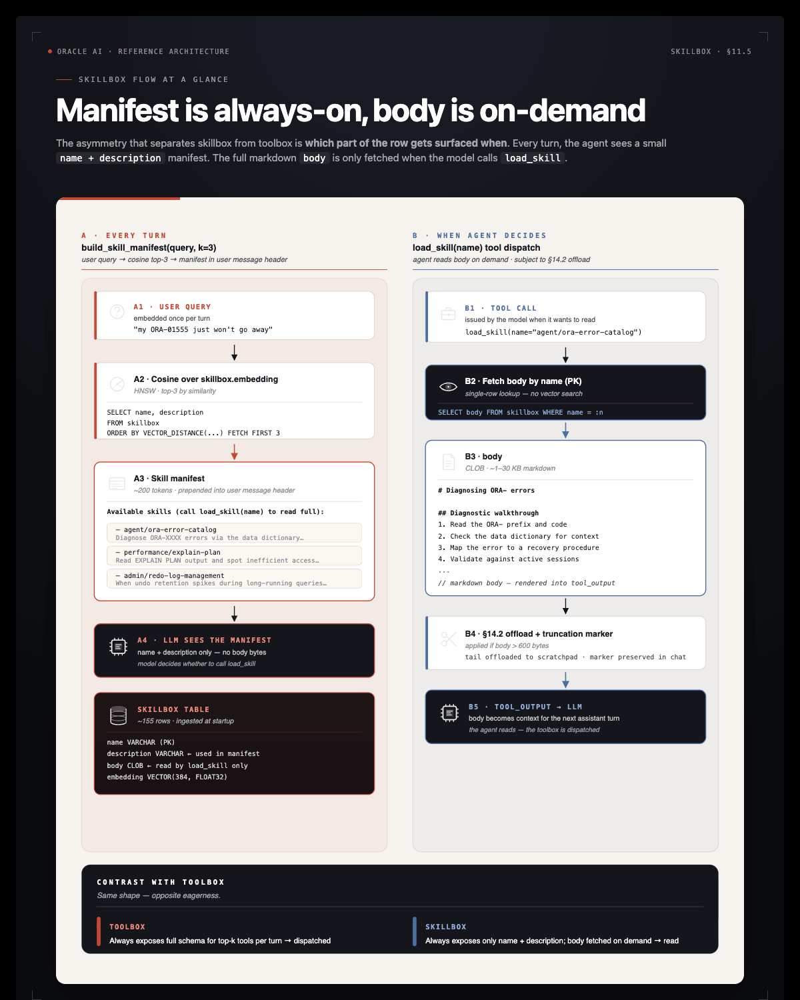

# Part 4: Toolbox and Skillbox

The agent needs a way to *do things* in the world — execute SQL, run code, write to a scratchpad, fetch a document. In this harness:

| Concept | Lives in | Consumed as |
|---|---|---|
| **Tool** | `toolbox` table (vector-indexed) | OpenAI-style function call, dispatched by the loop |
| **Skill** | `skillbox` table (vector-indexed) | Prose markdown the model reads on demand |

Both use the same retrieval primitive — vector search over an in-database HNSW index — but they are surfaced differently. Tools are *dispatched* (the loop runs them); skills are *read* (the loop inlines a manifest, the model decides whether to load the body).

## Why Vector-Indexed Tools?

If the registry has 6 tools, it's harmless to put them all in every LLM call. Once you have 30+ tools (per-system MCP servers, per-team helpers), the model starts confusing them and the per-turn token bill grows linearly with the registry. Indexing tools by an embedding of `name + description + arg names` lets us pass *only the relevant top-k* for a given user query.

We still always include a small **always-on** set. In the notebook that is `run_sql`, `search_knowledge`, `remember` and `load_skill`; the app adds `link_memories`, `exec_js` and the DBFS scratchpad tools, because its turns lean on them constantly. They're cheap, and the agent calls them on almost every turn.


## The `@register` decorator (§4.1)

`make_registry` in `workshop/tools.py` returns `(TOOLS, ALWAYS_ON_TOOLS, register)`. `@register` is argument-less: it introspects the function and records it in two places.

1. **`TOOLS`**: name → `(callable, OpenAI function schema)`. `build_schema(fn)` reads `fn.__name__` (a `tool_` prefix is dropped), `fn.__doc__` and the type hints.
2. **The `toolbox` row**: `upsert_toolbox_row` MERGEs name, description, parameters and an embedding computed in the database with `VECTOR_EMBEDDING(ALL_MINILM_L12_V2 ...)` from `"{name}: {description}\nargs: {arg names}"`. Re-registering a tool updates the row in place.

Every tool needs a docstring: it is the text that gets embedded and the description the model sees.

## TODO 6: `retrieve_tools`

§4.1. Rank the `toolbox` rows by cosine distance to the query, rerank the shortlist, then add the always-on tools so the model never loses the core set.

Steps: fetch `k * 4` rows `(name, description)` ordered by `VECTOR_DISTANCE(embedding, VECTOR_EMBEDDING(... USING :q AS DATA), COSINE)` (`wt.lob_text` turns a CLOB into `str`); `rerank(query, rows, top_k=k, content_key="content")`; keep names present in `TOOLS` and union in `ALWAYS_ON_TOOLS` without duplicates; return their schemas.

**Solution:**

```python
def retrieve_tools(query, k=6):
    with agent_conn.cursor() as cur:
        cur.execute("SELECT name, description FROM toolbox ORDER BY VECTOR_DISTANCE(embedding, "
                    f"VECTOR_EMBEDDING({ONNX_EMBED_MODEL} USING :q AS DATA), COSINE) FETCH FIRST :n ROWS ONLY",
                    q=query, n=k * 4)
        rows = [{"name": n, "content": wt.lob_text(d)} for n, d in cur]
    best = rerank(query, rows, top_k=k, content_key="content")
    return [TOOLS[n][1] for n in dict.fromkeys([r["name"] for r in best] + sorted(ALWAYS_ON_TOOLS)) if n in TOOLS]
```

The checkpoint right after `retrieve_tools` runs before any tool is registered, so it checks the return type and that every schema belongs to `TOOLS`. The `tool_run_sql` checkpoint then verifies that `run_sql` is retrievable.

## TODO 7: `tool_run_sql`

§4.2. `run_sql` is the agent's way to query live data. It must be read-only: `SELECT` and `WITH` only. `_READ_ONLY` is pre-defined:

```python
_READ_ONLY = re.compile(r"^\s*(select|with)\b", re.IGNORECASE)
```

Steps: reject statements that do not match `_READ_ONLY` with an error JSON; execute on `agent_conn`; return `wt.rows_json(cur, max_rows)`, which gives `{"columns": [...], "rows": [...], "row_count": N}`; wrap the execute so any database error returns `{"error": "..."}`. Keep `@register` and the docstring.

**Solution:**

```python
@register
def tool_run_sql(sql: str, max_rows: int = 50) -> str:
    """Execute a READ-ONLY SQL statement (SELECT/WITH only) against the Oracle AI Database and return up to `max_rows` rows as JSON."""
    if not _READ_ONLY.match(sql.strip()):
        return json.dumps({"error": "only SELECT / WITH statements are allowed in run_sql"})
    try:
        with agent_conn.cursor() as cur:
            cur.execute(sql)
            return wt.rows_json(cur, max_rows)
    except Exception as e:
        return json.dumps({"error": str(e)})
```

Notes:

- **The docstring is the tool description.** It tells the LLM *when* to call this tool, not just *how*. Prefer "Use this when..." phrasing.
- **`rows_json` serialises with `default=str`**, which handles `datetime`, `Decimal`, etc. that aren't JSON-native. Without this, dates raise `TypeError`.
- **Error handling returns JSON.** The LLM reads the tool output as a string; an error in JSON form is something it can react to ("the column doesn't exist, let me check the schema").
- **The regex is a first fence, not the boundary.** It does not parse SQL. What actually stops a hostile query is the kernel: the identity policies ([Deep Data Security reference](reference/deep-data-security.md)) decide which rows come back, and the app runs every `run_sql` on a private READ ONLY session (`identity_session` in `app/backend/db/deep_security.py`) with a denylist for dynamic-SQL packages and `FOR UPDATE`. The notebook leaves `agent_conn` alone because OAMP's background writes share it.

After this cell runs, `tool_run_sql` is in the `TOOLS` registry and a row in the `toolbox` table.

> **Note** `run_sql` is the one tool whose *results* depend on who is asking. The [Deep Data Security reference](reference/deep-data-security.md) wires an end-user context into it (`AGENT.set_eda_ctx`) so the database — not this function — decides which rows and columns come back. The notebook does not use that wiring.

## The core toolset (§4.3)

§4.3 registers these tools beyond `tool_run_sql`. The app adds the rest.

| Tool | What it does | Where |
|---|---|---|
| `scan_database(owner)` | Run the Part 2 scanner against a schema; append facts, links and a `scan_history` row. | notebook |
| `search_knowledge(query, k, kinds)` | Semantic search over the agent's long-term memory (`retrieve_knowledge`). | notebook |
| `remember(subject, body, kind, supersedes)` | Persist a correction or learning; `supersedes` retires the earlier fact it replaces. | notebook |
| `link_memories(source, target, link_type, reason)` | Connect two memories the agent already knows (`supports`/`contradicts` keep both current). | notebook |
| `load_skill(name)` | Read a skill body from the skillbox. | notebook |
| `fetch_tool_output(tool_call_id)` | Recover a tool output that the loop replaced with a truncation marker (§5.5). | notebook |
| `list_skills(query)` | Discover a skill by meaning (`tool_list_skills`, TODO 8). | notebook |
| `focus_world(target_kind, target, altitude)` | Resolve a branch, merchant, customer or region to a globe anchor; the app emits the camera move. | app |
| `exec_js(code)` | JavaScript inside Oracle MLE ([reference](reference/mle.md)). | app |
| `merchants_near(place, radius_km)` | Oracle Spatial: merchants within a radius of a branch city (`SDO_WITHIN_DISTANCE`). | app |
| `account_document(account_id)` | One account as a nested JSON document ([duality views](reference/duality-views.md)). | app |
| `scratch_write(path, content)` / `scratch_read(path)` / `scratch_append(path, content)` | DBFS scratchpad I/O ([reference](reference/dbfs.md)). | app |

The notebook's `search_knowledge` takes `(query, k, kinds)`; the app's variant adds `follow_links=True`, which asks OAMP for one hop of linked context per hit.

## Skills: Procedural Memory for *How* to Do Things

The toolbox answers *"what can the agent call?"* — function specs, dispatched as `tool_calls`. The **`skillbox`** answers a different question: *"what does the agent know how to do?"* — prose playbooks the model reads as part of its context.

Two procedural-memory tables, parallel structures:

| | `toolbox` | `skillbox` |
|---|---|---|
| Holds | Callable function specs | Prose markdown playbooks |
| Consumed as | `tools=[...]` parameter — dispatched | Text in context — read |
| Per-turn injection | Top-k schemas + always-on | Top-k *names + 1-line desc* (manifest) |
| Full content | n/a (functions just run) | `load_skill(name)` returns the body |



**Source: [`oracle/skills/db`](https://github.com/oracle/skills/tree/main/db).** Oracle publishes a curated library — 100+ guides organized by category (`agent`, `performance`, `security`, `plsql`, `sqlcl`, …). Each `.md` file is a skill: an H1 title, a first-paragraph description, and a body of prose + SQL examples.

The provisioning scripts mirror them into `skillbox` with their content SHA, so re-ingestion is idempotent. Injecting every skill body into every prompt would cost far too many tokens. Instead:

- The **manifest** (top-3 skill names + descriptions, each description cut to 240 characters) is prepended to every prompt by `build_skill_manifest`.
- The **full body** is one `load_skill(name)` tool call away.

The model sees the menu without paying for the meal.

## TODO 8: `tool_list_skills`

§4.4. `load_skill(name)` reads a skill body once the model knows the name. `tool_list_skills(query, k)` is the discovery half: cosine search over `skillbox.embedding`, the same primitive as the toolbox lookup.

Steps: select `name, category, description` from `skillbox` ordered by `VECTOR_DISTANCE(embedding, VECTOR_EMBEDDING(... USING :q AS DATA), COSINE)` and `FETCH FIRST :k ROWS ONLY`; return a JSON list of `{"name", "category", "description"}`, best match first.

**Solution:**

```python
@register
def tool_list_skills(query: str, k: int = 5) -> str:
    """Search the skillbox semantically. Returns top-k skills (name + description)."""
    with agent_conn.cursor() as cur:
        cur.execute("SELECT name, category, description FROM skillbox ORDER BY VECTOR_DISTANCE(embedding, "
                    f"VECTOR_EMBEDDING({ONNX_EMBED_MODEL} USING :q AS DATA), COSINE) FETCH FIRST :k ROWS ONLY", q=query, k=k)
        hits = [{"name": n, "category": c, "description": wt.lob_text(d)} for n, c, d in cur]
    return json.dumps(hits)
```

The checkpoint (`wt.check_skill_search`) searches the populated skillbox and fails on the stub and on trivial empty results.

## The globe tool: `focus_world` (app only)

The app registers one more tool, worth calling out because it returns a **place** instead of rows.

The app renders a World Explorer globe from `GET /api/world` in `app/backend/api/world_routes.py` — a dot per branch, a dot per merchant, and a red dot plus an arc per `FLAGGED` / `BLOCKED` transaction. `focus_world(target_kind, target, altitude)` lets the model move that camera:

| `target_kind` | Resolves against | Example |
|---|---|---|
| `branch` | branch code, name, or city | `Wall Street`, `Dubai` |
| `merchant` | merchant name or category | `BitVault Exchange` |
| `customer` | full name, anchored at their oldest account's branch | `Isabella Allen` |
| `region` | one of the four bank regions | `EUROPE` |

**Why it is a tool.** Look at what the tool actually is: a `SELECT` that turns a name into a `(lat, lng)`, plus a payload shape. That's all. There is no spatial-reasoning layer and no separate geo service. The same `branches` and `merchants` rows the agent already queries for answers are the rows that position the map — one source of truth, two renderings. It is the cleanest demonstration in this workshop that a tool is *just a function plus a schema*, and that `@register` doesn't care whether the return value means "rows", "a document", or "a place".

**Notebook versus app.** In the app the tool also emits a `focus_world` Socket.IO event that the React `WorldExplorer` listens for. Read `app/backend/agent/tools.py` and look for the `payload = {...}` dict.

> **Note** A customer resolves to a branch, not a location. A bank knows where an account was *opened*, not where its holder is standing. `_resolve_world_target("customer", ...)` therefore anchors at the customer's primary (oldest) account's branch — an ordering that exists only in `accounts.opened_ts`. Useful domain logic belongs in the tool, not in the prompt.

## Key takeaways: Part 4

- **Tools are Python callables with embeddings.** The `@register` decorator introspects the function and writes a vector-indexed row. Function name + docstring + arg names *are* the public spec.
- **Vector retrieval keeps the prompt lean.** With 30+ tools, including all of them every turn confuses the model. Top-k by cosine over the user query exposes only what's relevant — registry size grows without per-turn cost growing.
- **Always-on vs retrieved.** Cheap-and-frequent tools (`run_sql`, `search_knowledge`, `remember`, `load_skill`; the app adds `link_memories`, `exec_js` and the DBFS tools) ship in every prompt. Specialised tools come from the toolbox lookup.
- **Tools answer "what can I call?". Skills answer "what do I know how to do?".** Tools are dispatched as function calls; skills are prose playbooks the model reads.
- **A tool can return anything.** `run_sql` returns rows, `account_document` returns a JSON document, `focus_world` returns a place. The registry treats all three identically — name, docstring, args, embedding.

## Troubleshooting

**`ValueError: tool 'tool_run_sql' has no docstring`**: `build_schema` requires a docstring. Add one.

**`@register` raises `ORA-51962`** — The HNSW vector index couldn't be created. Check `vector_memory_size` and bounce the DB if needed (see [Part 1](part-1-setup.md)).

**`@register` succeeds but `retrieve_tools` returns empty results** — Run the cell that registers tools first. Without rows in `toolbox`, vector search has nothing to retrieve.

**`focus_world` returns `no branch found matching ...`** — The resolver is deliberately literal: `branch_code` exact-matches, `name`/`city` match with `LIKE`. Use values that exist in the seed — `Wall Street`, `Dubai`, `BitVault Exchange`, `Isabella Allen`, `EUROPE`.
